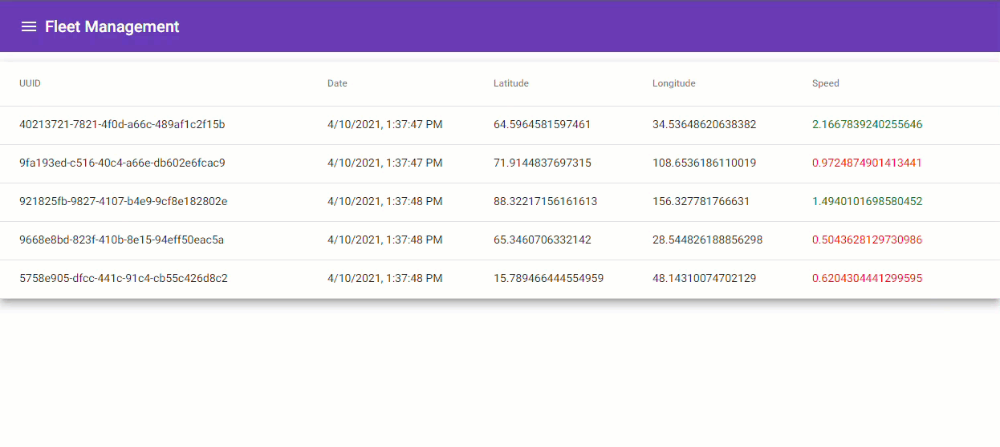
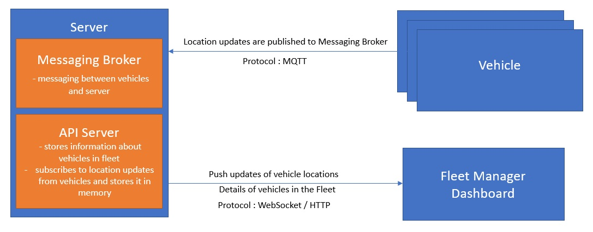
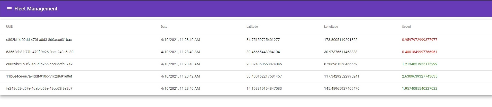

# Fleet Management System



## Problem Statement

The goal of this assignment is to find out how you, as a Full-stack Engineer, handle a scenario with the constraints and vagueness of the real world. We expect you to make a variety of assumptions given the information you have, and to clearly document them in the README.

A company has a number of vehicles around the country. You have been tasked to build a system to track the location of every vehicle in real-time. The system's dashboard will only display the last location of the vehicles, so the backend doesn't need to worry about the history. You can store the state of the application in-memory for simplicity reasons. Each vehicle should be associated with an unique identifier, and should report its geolocation coordinates to the central server in real-time through a cellular modem connection. Cellular modem connections are expensive, therefore you need to make sure the vehicles report back their location using as little data as possible. You are in charge of deciding the protocol and frequency that the vehicles will use to communicate with the backend. You are welcome to code a small vehicle simulation if that helps with testing, but its not mandatory.

The dashboard should be a simple single-page application displaying the list of active vehicles, by their unique identifiers, along with their current speed. You should visually highlight the vehicles that have not been moving for more than 10 seconds (the vehicle sent updates, but didn't move more that 1 meter).

Please provide a Dockerfile or a Docker Compose file so we can easily run your project. That being said, ShoppinPal is a Node.js based company, so we will appreciate if you provide additional comments and documentation if that's not the stack you chose, just to make it easier for us to review your solution. Alternatives are Python(Flask/Django preferred). And regarding frontend you should stick with AngularJS or Angular 2+ versions.

## Solution

There are 3 components in this System.
 - Vehicles, which sends their location updates to a server
 - Server which stores the current location information of the vehicles and provides information to the dashboard
 - Dashboard which displays information about the Live location of the vehicles.

This is built as a monorepo with each components having it's code segregated in it's own [package](./packages).

The solution can be run on Docker by running ```yarn run docker:simulate:start```. More details [here](#how-to-use).

### Architecture


### Vehicle

These are vehicles deployed on the road, which has to be tracked. Vehicles sends location updates to the Message Broker every 5 seconds. This has a Dockerfile [here](./packages/vehicle/Dockerfile_simulate).

[More Information](packages/vehicle/README.md)

### Server

Server consists of a Message Broker as well as an API Server.

#### Message Broker

Message broker protocol used is MQTT. It uses a pub-sub pattern. Vehicles 'publish' it's locations, and the API Server 'subscrbes' to the location updates. Here, there are multiple publishers and a single subscriber.

Here Eclipse Mosquitto is used as the Message Broker. It's usage can be seen in the [docker-compose-simulate.yaml](./docker-compose-simulate.yaml).

#### API Server

API Server is built on Express.js. There is an API endpoint ```/api/v1/fleet``` which can be used to do CRUD operations on the In-memory locations store. It uses Socket.IO for WebSocket connections. This is used to send location updates to the Dashboard. This has a Dockerfile [here](./Dockerfile).

[More Information](packages/api/README.md)

### Dashboard

Dashboard is built on Angular. It has a Table which displays the details of vehicles in the fleet, it's UUID, last updated date, Latitude, Longitude, Speed. This gets updated in realtime as new imformation gets pushed via the WebSocket connection. The Speed column values are shown in red if the speed is less than 1 and green, otherwise.



[More Information](packages/dashboard/README.md)

## Assumptions

 - MQTT was chosen for communication between vehicles and server as it's lightweight, runs on TCP and there are IoT devices capable of using this protocol.
 - Vehicle's [code implementation](packages/vehicle) was done in TypeScript but in an actual scenario, it could be another language. This was done for demonstration purposes.
 - Implementation was done in such a way that Vehicles talk to the server via MQTT and the Server stores the information and sends it to the dashboard via a WebSocket connection. The server is used because it models the real world scenario better. An easier messy solution is to use just an MQTT Message broker and let the dashboard also subscribe to the updates of vehicles via MQTT. This is not an ideal because, the historical data might need to be stored. Other Information about the vehicles might need to be stored, so it's useful to have a server too.
 - The Simulation also runs the vehicles' docker containers in the same Docker environment to generate random location data. In an actual system, the vehicles would have it's code running on the vehicles on an IoT device.

## How to Use

A Simulation has been implemented and it has been packaged into a [docker-compose file](./docker-compose-simulate.yaml). It can be started by running the below command.

```
yarn run docker:simulate:start

```
OR
```
docker-compose -f docker-compose-simulate.yaml --compatibility up -d
```

[Dashboard](http://localhost:3000)

To stop, run the below command.

```
yarn run docker:simulate:stop
```

### Containers

 - Mosquitto (mq)
 - API Server (fleet-api-server)
 - Simulation of vehicles (fleet-vehicle)

This runs the vehicles' random location data as separate containers. There are 5 replicas running for fleet-vehicle.

## Out of Scope

 - Authentication for vehicles publishing messages to Message Broker - Vehicles and the Server are physically separate and there needs to be a way to authenticate the vehicles. This can be done using a private key stored on the vehicles, which can be verified by the server. A key rotation mechanism can also be added for more security.
 - Authentication for viewing the Dashboard - There can be many ways authentication can be done for a person viewing the Dashboard. SSO would be ideal for an enterprise. Here, providing a local login using [Passport.js](www.passportjs.org) would just add some boilerplate code.
